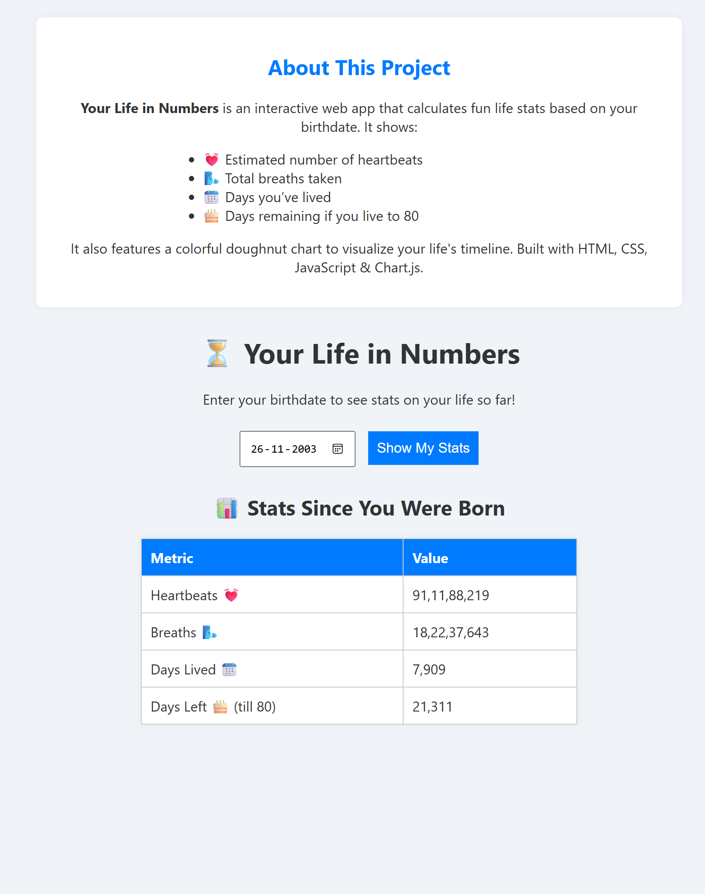

# ⏳ Your Life in Numbers

**Your Life in Numbers** is a fun, interactive web app that shows you surprising statistics about your life based on your **birthdate** — like how many heartbeats you’ve had, how many days you’ve lived, and how much time might be left if you live up to 80.

It also gives you a visual representation of your life using a **colorful doughnut chart**.

---

## 🎯 What It Shows

- 💓 **Estimated Heartbeats**
- 🌬️ **Total Breaths Taken**
- 📆 **Days You've Lived**
- 🎂 **Days Left (till 80 years)**
- 📊 **Interactive Chart of Your Life**

---

## 🛠️ Tech Used

- **HTML** – Layout
- **CSS** – Styling
- **JavaScript** – Functionality
- **Chart.js** – Chart visualization

---

## 🚀 How to Use

1. **Open `index.html`** in your web browser (double click or right click → open with browser)
2. Enter your **birthdate**
3. Click the **"Show My Stats"** button
4. View your life stats and a **doughnut chart** showing your life lived vs life left

No installation needed — just your browser!

---

## 🖼️ Preview

  

---

## 📂 Project Structure

| File         | Description                           |
|--------------|---------------------------------------|
| `index.html` | Main structure of the app             |
| `style.css`  | Clean and responsive styling          |
| `script.js`  | Life stat calculations and chart logic |
| `icon.png`   | Optional favicon for browser tab      |

---

## 🙋 Who Is It For?

This app is great for:

- Anyone curious about their **life stats**
- Students and teachers (fun for math/time concepts)
- People looking for a quick, interactive personal tool

---

## 💡 Bonus Ideas for Future

- ⌛ Add support for **custom life expectancy**
- 🧠 Include **brain activity estimates**
- 📱 Make it a **mobile app** or PWA

---

## 📜 License

This project is open-source and free to use for fun or learning.

---

> Made with ❤️ by [VarunCodeZone]
